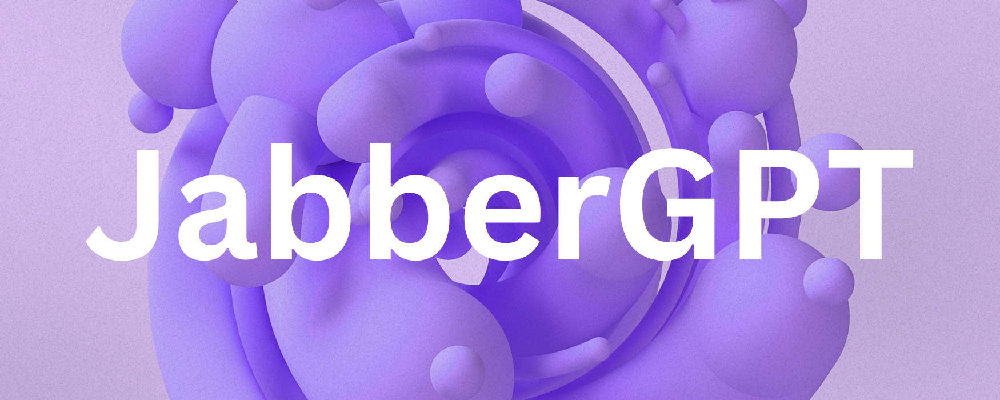
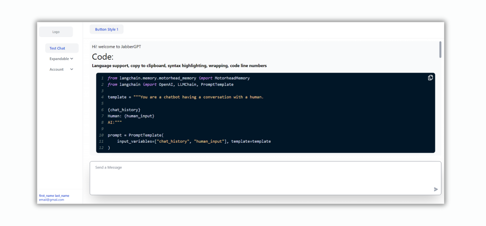

# JabberGPT
JabberGPT is a powerful and user-friendly locally running ChatGPT-like UI specifically designed for developers. With its simplicity and efficiency, JabberGPT provides an optimal experience for developers looking to integrate conversational AI into their applications.



## Features
1. **Seamless Chat UI:** Enjoy a hassle-free conversational experience with JabberGPT's chat user interface that does not require any backend connection.
2. **Markdown Support:** Easily format your messages using Markdown, allowing for rich and expressive conversations.
3. **Enhanced Rendering:** JabberGPT effortlessly renders various elements, including code snippets, math formulae, lists, heading tags, and tables, ensuring clear and structured conversations.
4. **Responsive Design:** Built with the Tailwind CSS framework, JabberGPT offers a responsive and visually appealing interface that adapts to different screen sizes and devices.
5. **Efficient State Management:** Powered by Redux Toolkit, JabberGPT provides efficient state management, ensuring smooth and consistent interactions within the UI.
6. **hyperUI.dev Integration:** Utilizing components from hyperUI.dev, JabberGPT leverages high-quality UI components to deliver a polished and professional user experience - so that your development is lightning fast!


## Getting Started
To start using JabberGPT in your development environment, follow the instructions below:

```bash
git clone https://github.com/psymbio/jabberGPT.git
cd frontend
yarn install
yarn build
yarn start
```

Access JabberGPT in your browser at http://localhost:3000

## Contributing
We welcome contributions from the developer community to enhance JabberGPT. To contribute, please follow the guidelines outlined in CONTRIBUTING.md.

## License
JabberGPT is licensed under the MIT License. See LICENSE for more information.